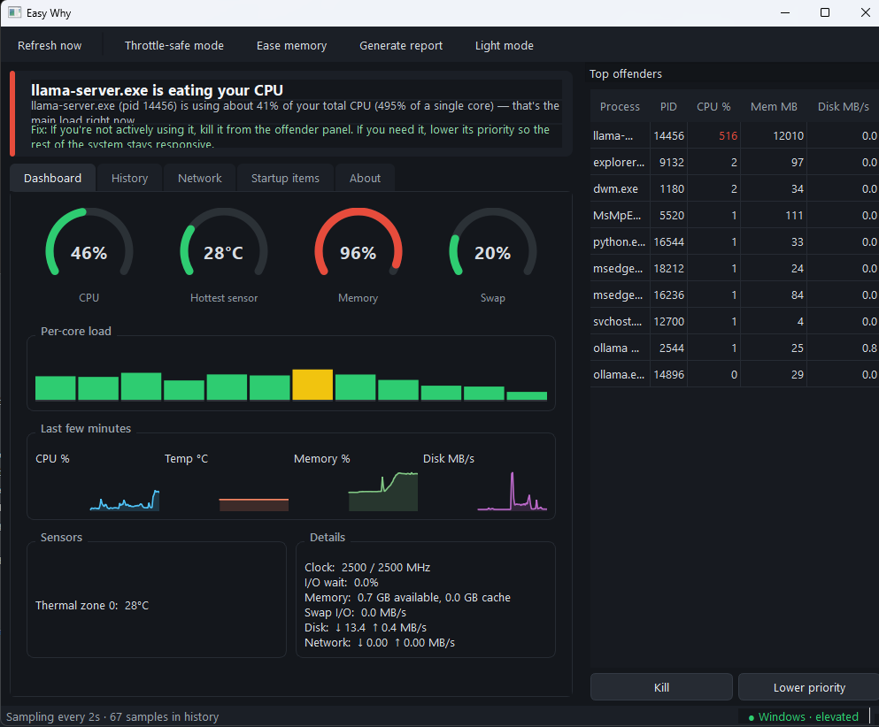

<div align="center">


<b><i>A Norac Projects tool</i></b>



<br/>
<br/><br/>

<br />

<p>
  
  
  
  
  
</p>

<br />


</div>

Task Manager shows you a wall of numbers. `htop` shows you a prettier wall of numbers. Easy Why looks at those numbers *for* you and says, in plain English: 

> **"Chrome is using 250% CPU across 10 processes — that's why your fans are screaming. Close some tabs or check for a runaway extension."** 

That's the whole pitch. A diagnostic tool that finds the root cause, names it, and hands you the fix — on **Windows, Linux, and Raspberry Pi**. 

--- 

## 💡 Why this exists 

I got tired of the same ritual: laptop fans take off like a jet, I open a system monitor, stare at a sorted process list, squint at temperatures, and *infer* what's wrong like some kind of thermal detective. Meanwhile my mom just wants to know why her computer is loud. 

System monitors show symptoms. Easy Why does the diagnosis. 

## 🎯 What it catches 

Easy Why doesn't just threshold-check numbers — it recognizes the actual patterns behind 90% of "why is my computer being weird" moments: 

| 🚨 Pattern | 🗣️ What Easy Why tells you | 
| :--- | :--- | 
| 🔥 **Thermal throttling** | `"CPU is thermally throttling at 89°C"` — it checks the *actual clock speed under load*, not just the temperature. Low clock at idle is normal; low clock at full load is throttling. Most tools can't tell the difference. | 
| 🌐 **Browser tab bloat** | Sums CPU across all of a browser's helper processes, because `"chrome.exe ×14"` hiding in a process list is how browsers get away with it | 
| 💾 **Swap thrash** | The classic `"it's not the CPU, it's the disk"` case — RAM full, OS shoveling memory to swap, everything frozen while CPU sits at 10% | 
| 🐌 **Disk-bound system** | High I/O wait means your machine is waiting on the disk, not computing. Names the process doing the writing. | 
| 🥔 **Pi undervoltage** | Reads `vcgencmd get_throttled` bits directly and tells you it's your cheap USB cable, *by name*, before your SD card corrupts | 
| 🧴 **Dried thermal paste** | High temps at near-zero load, sustained over time — the signature of paste that gave up or a heatsink full of dust | 
| 📦 **Stuck backups & runaway indexers** | Knows the usual suspects (SearchIndexer, tracker-miner, rsync, OneDrive...) and tells you whether to wait it out or kill it | 
| 🔊 **Fan noise correlation** | Fan spun up? It tells you *which process* caused the temperature spike that caused the noise | 
| 🌍 **Unexpected network traffic** | Something quietly pulling gigabytes? The Network tab ranks apps by live connections so you can spot the sync, update, or download you didn't start | 

## 🛠️ What it does about it 

Every verdict comes with a fix, and the fixes you can do in one click are right there — **always behind an explicit confirmation, never automatic, reversible wherever the OS allows**: 

- 🛑 **Kill or de-prioritize** the offender straight from the always-visible Top Offenders panel 
- 🛡️ **Throttle-safe mode** — cap the CPU at ~60% so an overheating machine runs *steady* instead of stuttering through erratic throttle cycles. One click to undo. Auto-restores on exit. 
- 🧠 **Ease memory pressure** — see the biggest RAM hogs ranked, close them, drop disk caches (Linux/Pi) 
- 🚀 **Disable startup items** that quietly add background load at every login (reversible toggle) 
- 📝 **Generate a report** for the fixes an app can't do — concrete evidence to bring to a repair shop or forum instead of "it's, like, hot?" 

## ⏳ The receipts: history & timeline 

Fans spun up ten minutes ago and calmed down before you could look? Easy Why logs in the background every 2 seconds. Open the **History** tab, hover anywhere on the timeline, and see CPU, temperature, memory, and disk overlaid — plus exactly which processes were on top at that moment. The spike has nowhere to hide. 

## 🎛️ The cockpit 

- 📊 **PySide6 dashboard** — arc gauges, per-core load bars, live sparklines, full sensor readout (every temp sensor, fan RPM, clock speed, I/O wait, swap traffic, network throughput, battery drain) 
- 🌐 **Network tab** — live up/down throughput plus a per-app connection breakdown to catch traffic you didn't start 
- 🔄 **Refresh Now button** — force an instant sample instead of waiting for the next tick 
- 🎨 **Color-coded severity** everywhere — green/yellow/red, problems visible from across the room 
- 🌙 **Dark mode by default**, light mode one click away 
- 📱 **Responsive** — comfortable on a big monitor, usable on a Pi touchscreen 
- ⚠️ **Elevation status always visible** — the app tells you up front which features need admin/root and how to relaunch, instead of failing silently 

## 🔒 Privacy 

Nothing leaves your machine. No telemetry, no network calls, no accounts, no nonsense. It's a diagnostic tool, not a data harvester. 
<br/><br/>

## ⬇️ Download EasyWhy

**Just want to use EasyWhy?** Download the ready-to-run Windows app — no Python, installation, or setup required.

<p align="center">
  <a href="https://github.com/Norac-projects/easy-why/releases/latest/download/EasyWhy.exe">
    
  </a>
  <br>
  <sub>Windows • Latest release</sub>
</p>

### How to run

1. Click **Download EasyWhy.exe** above.
2. Double-click **`EasyWhy.exe`**.
3. For full sensor access and the ability to apply fixes, **right-click → Run as administrator**.

EasyWhy can still run without administrator privileges and will clearly indicate anything that is unavailable.

> 🖥️ **Using Linux or Raspberry Pi?**
> The `.exe` is Windows-only. See the **[Quick Start](#-quick-start)** section for running EasyWhy from source.

> ⚠️ **Windows SmartScreen**
> EasyWhy is currently unsigned, so Windows may show **“Windows protected your PC.”** If this appears, click **More info → Run anyway**.

### 🧑‍💻 Developers

Want to build EasyWhy from source, contribute, or explore the project internals?

Skip the `.exe` and continue to **[Quick Start](#-quick-start)** and **[Project Layout](#-project-layout)**.

<br/><br/>

## 🚀 Quick start 

```bash 
git clone https://github.com/Norac-projects/easy-why.git
cd easy-why
pip install -r requirements.txt
python main.py
```

That's it — one file, no `python -m` gymnastics. For full sensor access and remediation powers, run elevated (`sudo python main.py` / "Run as administrator"). The app works fine without it and clearly marks what's limited.

**New to this stuff?** There's a zero-assumed-knowledge walkthrough in [**THE_POTATO_PROTOCOL.md**](THE_POTATO_PROTOCOL.md) — my signature guide format. If you can microwave a potato, you can run this app.

## 📦 Building a standalone .exe (Windows)

No Python required for the people you send it to:

```bash
pip install -r requirements.txt
pyinstaller EasyWhy.spec
```

Grab `dist/EasyWhy.exe` — single file, double-click, done. On Linux/Pi, the standard `pip install` route is the recommended path (PyInstaller works there too, but the binary is tied to the machine's glibc, so build it on the target).

## 📂 Project layout

```text
easy-why/
├── main.py                  # entry point — python main.py, that's all
├── requirements.txt         # platform-conditional deps, installs clean everywhere
├── EasyWhy.spec             # PyInstaller one-file build
└── src/easywhy/
    ├── monitor.py           # background sampler + 30-min rolling history
    ├── diagnosis.py         # the verdict engine — patterns, not thresholds
    ├── actions.py           # kill / renice / cache drop / CPU cap (all 3 platforms)
    ├── network.py           # per-app connection attribution
    ├── startup.py           # startup item manager
    ├── report.py            # exportable diagnostic report
    ├── elevation.py         # admin/root detection + relaunch hints
    ├── sensors/             # auto-selected platform backends
    │   ├── linux.py         #   psutil sensors
    │   ├── pi.py            #   + vcgencmd throttle/undervoltage bits
    │   └── windows.py       #   LibreHardwareMonitor/OHM WMI, ACPI fallback
    └── ui/                  # PySide6: dashboard, timeline, offender dock,
                             # startup tab, about tab, themes, custom widgets
```

## 💻 Languages

| Language | Share |
| :---: | :---: |
| 🐍 **Python** | **100%** |

Pure Python 3.13 front to back — the UI styling is Qt stylesheets embedded in Python, so GitHub's language bar shows a clean 100% Python. Set the repo language accordingly.

## ⚙️ Requirements

- 🐍 **Python 3.13**
- 🖥️ **Runs on Windows 10/11, any modern Linux, Raspberry Pi OS**
- 🌡️ On Windows, temperatures are richest with [LibreHardwareMonitor](https://github.com/LibreHardwareMonitor/LibreHardwareMonitor) running (Easy Why auto-detects it); without it, ACPI thermal zones are used as a fallback


---
## 📬 Reach Me

<p align="center">
  <a href="[your-instagram-link]"></a>
  <a href="[your-telegram-link]"></a>
  <a href="[your-reddit-link]"></a>
  <a href="mailto:[your-email]"></a>
</p>

<div align="center">

| Platform | Handle |
|---|---|
| ✉️ Email | `Norac-Projects@Proton.me` |
| ✈️ Telegram | `@NoracProjects` |
| 📷 Instagram | `@NoracProjects` |
| 🟠 Reddit | `u/Norac-Projects` |

</div>


## 🤝 Let's Collaborate

I'm always up for teaming up on **desktop tooling, industrial/OT software,
embedded systems, Raspberry Pi projects, or anything privacy-first**. If
you've got an idea, a gap you've noticed in the tooling world, or just want
to build something that doesn't need a cloud subscription to function — open
an issue, send a message, or just say hi.


## ☕ Support the Work

If one of these tools saved you an afternoon (or a server), you're welcome to
buy me a coffee — entirely optional, always appreciated, never expected.

<div align="center">

**₿ Bitcoin (BTC)** : 
1Ka1cNmfhbNej9iiLzvfVzYqEZh2e1vbNk

---

## 📜 License

**MIT** — see [LICENSE](LICENSE). Use it, fork it, ship it.

</div>
<p align="center">
  <i>Built because "why is my computer doing that" deserves an actual answer.</i>
</p>
